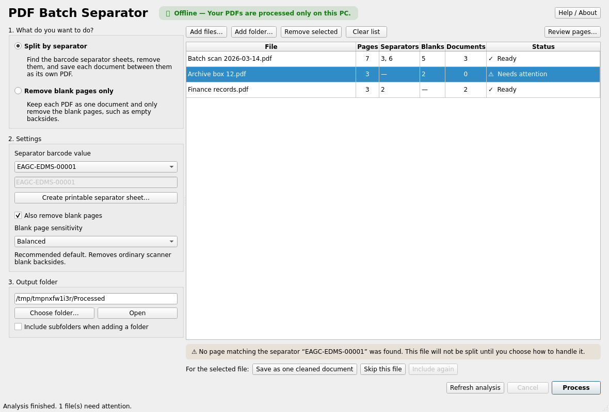

# PDF Batch Separator

A focused, offline Windows desktop utility that does two jobs on scanned PDFs:

1. **Split PDFs at separator sheets** — find pages carrying a configured
   barcode, remove those separator pages, and save each document between them
   as its own PDF.
2. **Remove blank pages** — detect scanner-generated blank pages and leave them
   out, either while splitting or as a standalone cleanup.

Everything happens on the local machine. There is no server, no cloud account,
no browser, and no internet connection required — and no Python, Poppler, ZBar
or Tesseract for the end user to install.



---

## Table of contents

- [What it does and does not do](#what-it-does-and-does-not-do)
- [Using the application](#using-the-application)
- [Safety guarantees](#safety-guarantees)
- [Blank-page sensitivity](#blank-page-sensitivity)
- [Warnings you may see](#warnings-you-may-see)
- [Development setup](#development-setup)
- [Running the tests](#running-the-tests)
- [Acceptance verification](#acceptance-verification)
- [Building the Windows application](#building-the-windows-application)
- [Building the installer](#building-the-installer)
- [Portable build](#portable-build)
- [Code signing and SmartScreen](#code-signing-and-smartscreen)
- [Project layout](#project-layout)
- [Licensing](#licensing)

---

## What it does and does not do

**It does:**

- split at Code 128 separator sheets (`EAGC-EDMS-00001`, `PATCHT`, or a custom
  value up to 128 characters);
- remove blank pages with three conservative-to-aggressive profiles;
- analyse a whole batch before writing anything, and show what it found;
- let you correct any page's status before processing;
- generate a printable A4 Code 128 separator sheet;
- write a plain-text batch report next to the results.

**It deliberately does not:** run OCR, classify documents, use AI, rename files
based on content, index anything, or integrate with SharePoint or any cloud
service. OneDrive-synced folders work because Windows presents them as ordinary
local folders.

## Using the application

1. Launch **PDF Batch Separator** from the Start menu.
2. Drag PDFs into the window, or use **Add files** / **Add folder**.
3. Pick a mode: **Split by separator** or **Remove blank pages only**.
4. In split mode, choose a separator preset or type a custom value.
5. Keep or clear **Also remove blank pages**.
6. Choose the output folder (a `Processed` folder next to your first input is
   suggested automatically).
7. Press **Analyse** (`F5`). The batch table fills in with pages, detected
   separators, detected blanks and the number of documents that would result.
8. Select a row and press **Review pages…** to see thumbnails and change any
   page's status.
9. Press **Process**. When it finishes you get a summary with **Open output
   folder**, **Copy report** and **Process another batch**.

### Making separator sheets

With a separator value selected, press **Create printable separator sheet…**.
Print the resulting A4 PDF at 100% scale (no "fit to page"), and put one sheet
between each pair of documents before scanning.

For reliable detection:

- Print at **100% scale**. A sheet reduced to roughly half size and then
  scanned at a low resolution can become undecodable.
- Scan at **200 DPI or better**. 300 DPI is ideal; detection was measured at
  100% down to 150 DPI.
- Any page orientation works — the sheet is found upside down or rotated 90°.

If a separator is missed, the file is held back with a warning rather than
being split incorrectly, so a bad sheet can never silently corrupt a batch.

## Safety guarantees

These are enforced in code and covered by automated tests:

| Guarantee | How it is enforced |
|---|---|
| Source PDFs are never modified | Sources are opened read-only; a test compares SHA-256 digests before and after a run |
| Existing files are never overwritten | Output names gain ` (2)`, ` (3)`, … when taken |
| No partial files are left behind | Each output is written to a temporary file in the destination, validated by re-opening it and checking the page count, then atomically renamed |
| A missing separator never becomes a silent one-file "split" | Such files are held back with a warning until you choose: change the value and re-analyse, save as one cleaned document, or skip |
| One bad PDF cannot stop the batch | Failures are isolated per file and reported individually |
| Nothing leaves the machine | `tests/test_no_network.py` poisons sockets during a real run and fails if anything connects |

## Blank-page sensitivity

A page is measured by converting it to grayscale, binarizing relative to the
page mean, cropping the scanner edges, removing dust with a morphological
opening, and computing the remaining ink ratio.

| Profile | Use when | Ink-ratio threshold |
|---|---|---|
| **Conservative** | You would rather keep a blank page than risk losing content | 0.0015 |
| **Balanced** (default) | Ordinary office scans with empty backsides | 0.005 |
| **Aggressive** | Noisy or speckled blank scans; shows an extra review reminder | 0.015 |

Two extra safeguards apply at *every* profile, because deleting real content is
worse than keeping an unwanted blank page:

- a page whose average tone is dark (a photograph or a black scan) is never
  blank, even though its mean-relative ink ratio is near zero;
- a page with a *concentrated* mark — one word, a signature, a stamp — is never
  blank, even though its overall ink ratio is tiny.

Blank detection never uses OCR.

## Warnings you may see

| Warning | Meaning | What to do |
|---|---|---|
| **No separator found** | No page matched the configured value | Change the value and re-analyse, save the file as one cleaned document, or skip it |
| **Other barcode detected** | A different barcode was decoded | Check whether that value is the marker you actually print |
| **Every page would be removed** | Nothing would be exported | Keep a page in the review dialog, or skip the file |
| **Empty sections ignored** | Separators were adjacent, leading or trailing | Usually harmless |
| **Digitally signed PDF** | The source carries a signature | Exported pages are rewritten, so the signature will not stay valid |
| **Password protected** | The PDF is encrypted | Remove the password first; MVP does not prompt for one |

---

## Development setup

Requires Python 3.12 (3.11 also works for development; the packaged build pins
3.12).

```bash
git clone https://github.com/jak0d/JuaDex-Windows.git
cd JuaDex-Windows/pdf-batch-separator

python -m venv .venv
.venv\Scripts\activate          # Windows
# source .venv/bin/activate     # Linux/macOS

pip install -e ".[dev,build]"
```

Run the application from source:

```bash
python -m pdf_batch_separator
```

## Running the tests

```bash
pytest                      # everything
pytest -m "not slow"        # skip the page-rendering heavy cases
pytest tests/test_ui_workflows.py   # UI workflows only
```

The UI tests need a Qt platform plugin. On a headless machine use:

```bash
QT_QPA_PLATFORM=offscreen pytest
```

Test fixtures — including separator sheets, degraded scans, faint-pencil pages
and dark pages — are generated from code at test time by
`tests/fixtures/builders.py`. No real or confidential documents are stored in
the repository.

## Acceptance verification

`docs/ACCEPTANCE.md` records how every acceptance criterion was verified, the
measured numbers behind each one, and the test that enforces it. The figures
can be reproduced with:

```bash
PYTHONPATH=src:tests python tests/acceptance_corpus.py
```

Headline results: 100% separator detection over 42 realistic scan variants,
zero false blank removals across 18 content-page/sensitivity combinations,
sources byte-identical after every run, and first page status in under half a
second.

## Building the Windows application

On 64-bit Windows 10 or 11:

```bat
pip install -e ".[build]"
pyinstaller packaging\app.spec --noconfirm --clean
```

This produces `dist\PDF Batch Separator\` containing
`PDF Batch Separator.exe` plus Python and every native dependency. It is a
**windowed** build: no console window appears.

Keep the one-folder layout for anything you distribute — it keeps the Qt DLLs
replaceable, which is how this build satisfies Qt's LGPL terms. A one-file
executable can be produced for local testing with `set ONEFILE=1` before
running PyInstaller, but it is not the recommended distribution format.

Refresh the bundled licence texts whenever a dependency version changes:

```bat
python packaging\collect_licenses.py
```

## Building the installer

Install [Inno Setup 6](https://jrsoftware.org/isdl.php), then:

```bat
"C:\Program Files (x86)\Inno Setup 6\ISCC.exe" packaging\installer.iss
```

The result is
`installer_output\PDF-Batch-Separator-1.0.0-Setup.exe`.

The installer:

- targets 64-bit Windows 10 (build 10.0) and later;
- installs per-user by default so a standard account needs no administrator
  rights, and offers a per-machine install when run elevated;
- creates a Start-menu entry and an optional desktop shortcut;
- ships `LICENSE`, `PRIVACY.md` and `THIRD_PARTY_NOTICES.md`;
- removes only its own log folder on uninstall — your documents are untouched.

## Portable build

The one-folder output is already portable. To publish it:

```bat
powershell Compress-Archive -Path "dist\PDF Batch Separator\*" ^
    -DestinationPath "PDF-Batch-Separator-1.0.0-portable.zip"
```

Unzip anywhere and run `PDF Batch Separator.exe`. Preferences are still stored
per user in the registry; delete `HKCU\Software\PDF Batch Separator` to reset.

## Code signing and SmartScreen

Unsigned builds trigger a **"Windows protected your PC"** SmartScreen prompt;
users must choose *More info → Run anyway*. This is expected for test builds.

To sign a release, sign both the application executable and the installer:

```bat
signtool sign /fd SHA256 /tr http://timestamp.digicert.com /td SHA256 ^
    "dist\PDF Batch Separator\PDF Batch Separator.exe"

signtool sign /fd SHA256 /tr http://timestamp.digicert.com /td SHA256 ^
    "installer_output\PDF-Batch-Separator-1.0.0-Setup.exe"
```

An EV certificate clears SmartScreen immediately; an OV certificate builds
reputation over time. Publish SHA-256 checksums with each release:

```bat
certutil -hashfile "installer_output\PDF-Batch-Separator-1.0.0-Setup.exe" SHA256
```

## Project layout

```text
pdf-batch-separator/
├── src/pdf_batch_separator/
│   ├── app.py                  # startup and global error boundary
│   ├── __main__.py             # python -m entry point
│   ├── settings.py             # QSettings preferences (no history)
│   ├── logging_config.py       # content-free local log
│   ├── workers.py              # Qt worker threads and cancellation
│   ├── core/                   # framework-independent processing
│   │   ├── analyzer.py         # render, decode, classify, group
│   │   ├── barcode.py          # normalisation, matching, retry ladder
│   │   ├── blank_pages.py      # blank detection and profiles
│   │   ├── grouping.py         # grouping rules and warnings
│   │   ├── exporter.py         # atomic, non-overwriting output
│   │   ├── naming.py           # Windows-safe names and collisions
│   │   ├── batch.py            # bounded worker pool
│   │   ├── separator_pdf.py    # printable Code 128 sheet
│   │   ├── report.py           # UTF-8 batch report
│   │   └── models.py           # immutable result types
│   └── ui/
│       ├── main_window.py
│       ├── batch_model.py
│       └── document_review.py
├── tests/                      # 233 automated tests
├── packaging/
│   ├── app.spec                # PyInstaller
│   ├── installer.iss           # Inno Setup
│   ├── version_info.txt        # Windows version resource
│   └── collect_licenses.py
├── LICENSES/                   # generated dependency licence texts
├── PRIVACY.md
├── THIRD_PARTY_NOTICES.md
└── pyproject.toml
```

The `core/` package has no Qt import at all, so the processing logic can be
tested headlessly and reused from a future CLI.

## Licensing

This project's own source code is MIT licensed (see `LICENSE`).

**Before distributing a built application, read `THIRD_PARTY_NOTICES.md`.** Two
dependencies carry obligations that the MIT licence does not cover:

- **PyMuPDF / MuPDF** is AGPL-3.0-or-later, or a paid commercial licence from
  Artifex. Distributing binaries outside your organisation under AGPL requires
  offering the complete corresponding source of the combined work.
- **Qt via PySide6** is LGPL-3.0. The one-folder build keeps Qt dynamically
  linked and replaceable, which is what satisfies those terms.

Internal deployment inside a single organisation — the intended use for this
product — is the straightforward case.
